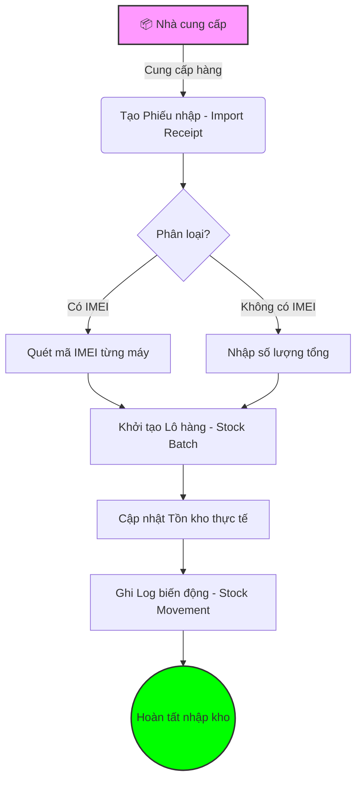
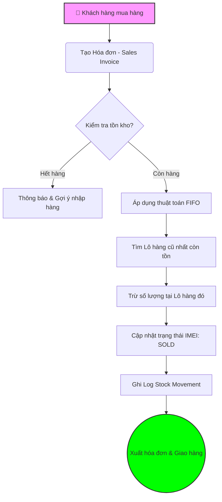
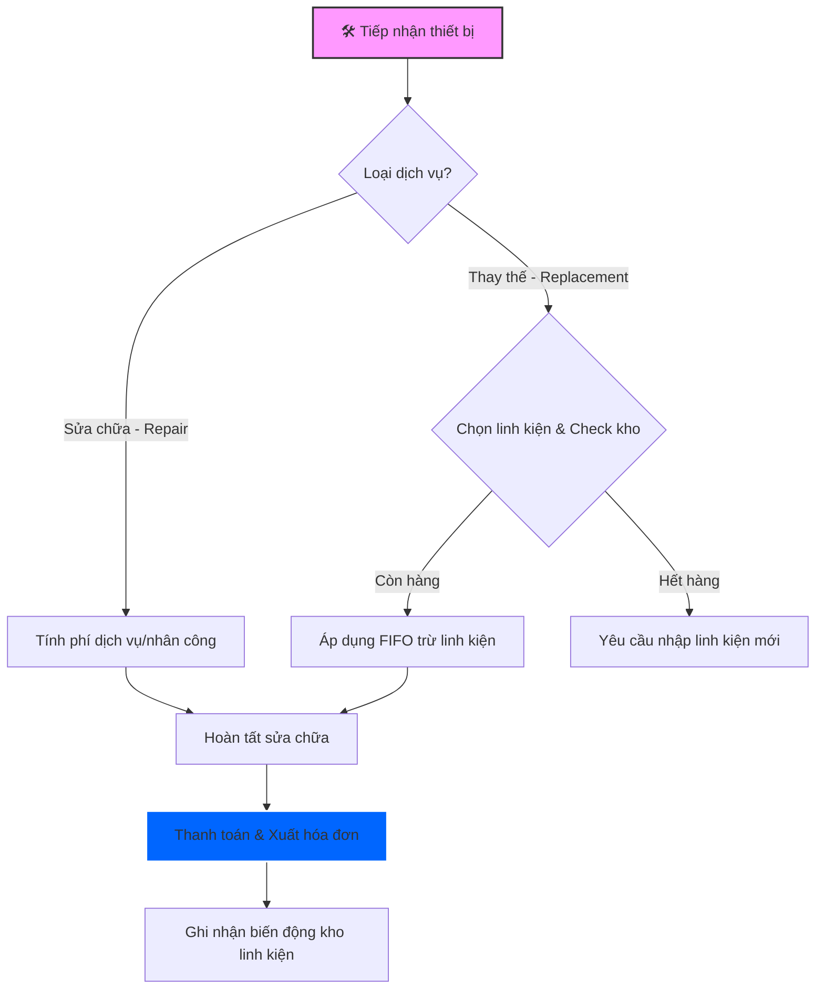
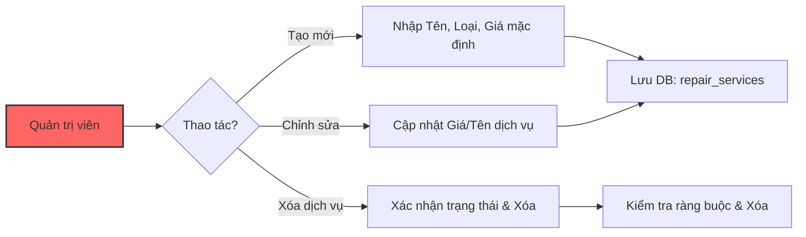

# 📱 PhoneShop Warehouse Management System

Hệ thống Quản lý Kho (Warehouse Management System - WMS) chuyên dụng cho cửa hàng điện thoại và bán lẻ, được xây dựng với kiến trúc hiện đại, hỗ trợ quản lý tồn kho theo lô (FIFO), theo dõi IMEI và quy trình sửa chữa chuyên nghiệp.

---

## 🏗️ Kiến trúc Công nghệ (Tech Stack)

### **Backend: NestJS (Node.js framework)**
- **Database:** SQL Server (MSSQL)
- **ORM:** TypeORM
- **Tính năng chính:** 
  - API RESTful với tiền tố `/api`.
  - Quản lý giao dịch (Transactions) đảm bảo tính toàn vẹn dữ liệu.
  - Logic trừ kho theo nguyên tắc **FIFO** (First In - First Out).
  - Tự động ghi log lịch sử biến động kho (`stock_movements`).

### **Frontend: React + Vite**
- **UI Framework:** Vanilla CSS (Premium Dark Theme) + Tailwind-inspired utilities.
- **Icons:** Lucide React.
- **Tính năng chính:**
  - Dashboard tổng quan với các chỉ số real-time.
  - Quản lý danh mục sản phẩm, nhà cung cấp & dịch vụ sửa chữa.
  - Form nhập hàng/bán hàng linh hoạt.
  - Theo dõi tồn kho tổng hợp và lịch sử chi tiết.

---

## 🔄 Quy trình Nghiệp vụ (Business Flow)

### 1. Quy trình Nhập hàng (Import Flow)
Mô tả cách thức hàng hóa được đưa vào kho và quản lý theo lô.



### 2. Quy trình Bán hàng & Logic FIFO (Sales & FIFO Flow)
Hệ thống tự động ưu tiên xuất các lô hàng nhập trước để tối ưu dòng vốn và hạn sử dụng.



### 3. Quy trình Dịch vụ Sửa chữa (Repair & Replacement Flow)
Quy trình đặc thù kết hợp giữa dịch vụ kỹ thuật và quản lý linh kiện.



### 4. Quản lý Danh mục Dịch vụ (Service Management Flow) - Mới
Dành cho người quản trị để thiết lập bảng giá dịch vụ và linh kiện.



---

## 📦 Các Phân hệ Chức năng

### **1. Tổng quan (Dashboard)**
- Hiển thị tổng số sản phẩm, tổng tồn kho thực tế.
- Cảnh báo sản phẩm sắp hết hàng (Low Stock).
- Danh sách 10 hoạt động kho gần nhất.

### **2. Sản phẩm & Nhà cung cấp**
- Quản lý thông tin chi tiết: Mã SP, Barcode, Thương hiệu, Đơn giá, Tồn tối thiểu.
- Quản lý danh sách đối tác cung cấp hàng.

### **3. Quản lý Nhập kho (Imports)**
- Tạo phiếu nhập hàng với nhiều sản phẩm cùng lúc.
- Mỗi lần nhập sẽ tạo ra một **Lô hàng (Stock Batch)** riêng biệt.
- Hỗ trợ lưu mã IMEI cho từng máy khi nhập vào.

### **4. Quản lý Sửa chữa & Dịch vụ (Repairs & Services)**
- **Ticket sửa chữa:** Quản lý quy trình tiếp nhận, theo dõi linh kiện.
- **Danh mục dịch vụ:** Thêm/Sửa/Xóa các dịch vụ định sẵn (thay pin, thay màn hình...).
- **Tích hợp kho:** Tự động trừ kho linh kiện khi sử dụng dịch vụ loại `REPLACEMENT`.

---

## 🗃️ Cấu trúc Cơ sở dữ liệu (Database Schema)

- `products`: Thông tin sản phẩm & linh kiện.
- `suppliers`: Nhà cung cấp.
- `import_receipts` & `import_receipt_items`: Phiếu nhập và chi tiết lô hàng.
- `stocks`: Theo dõi số lượng còn lại của từng lô nhập (Trái tim của FIFO).
- `sales_invoices`: Hóa đơn bán lẻ.
- `repairs` & `repair_services`: Quản lý dịch vụ sửa chữa và thay thế.
- `stock_movements`: Nhật ký biến động kho tập trung.
- `product_imeis`: Quản lý định danh duy nhất (IMEI/Serial).

---

## 🔧 Hướng dẫn Cài đặt

### **Bước 1: Cấu hình Backend**
1. Vào thư mục `backend/`.
2. Tạo file `.env` và cấu hình SQL Server:
   ```env
   DB_HOST=localhost
   DB_PORT=1433
   DB_USERNAME=sa
   DB_PASSWORD=your_password
   DB_DATABASE=PhoneShopDB
   PORT=3000
   ```
3. Chạy: `npm install` và `npm run start:dev`.

### **Bước 2: Cấu hình Frontend**
1. Vào thư mục `frontend/`.
2. Chạy: `npm install`.
3. Khởi động: `npm run dev`.


